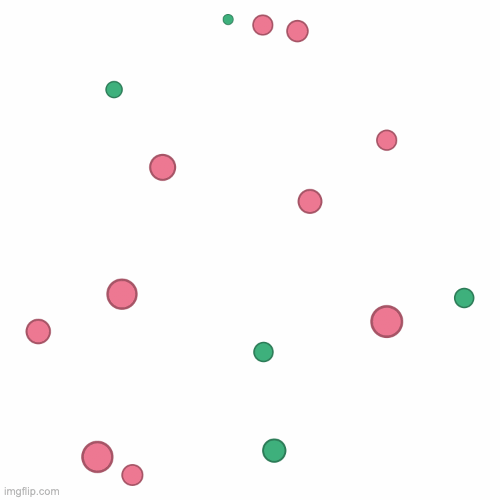

# fairpair

Create and evaluate pairwise comparison graphs.

Install the python package with
```
pip install git+https://github.com/wanLo/fairpair
```

<div align="center">
    
</div>

Animated example of the ProbKnockout sampling strategy. Minority nodes in green, majority nodes in pink, node size by initial score. Edge direction towards winner of comparison (BTL-model), edge width by weight, edge color by #comparisons.

## Overview

See [example.ipynb](example.ipynb) for a general overview of the available functionality, [sampling.ipynb](sampling.ipynb) for a comparison of proposed sampling strategies, and [ranking.ipynb](ranking.ipynb) for how to generate and evaluate rankings.

The package consists of the following parts:
- [fairgraph.py](fairpair/fairgraph.py) implements `FairPairGraph` as a subclass of networkx.DiGraph with functions required for generating a graph with two classes and scores for each node, as well as an implementation of the BTL-model for comparing pairs.
- [distributions.py](fairpair/distributions.py) supplies usefull wrappers to sample scores.
- [sampling.py](fairpair/sampling.py) implements a general `Sampling` class which is able to generate statistics while sampling is applied, and supplies implementations for the following sampling methods: `RandomSampling`, `ProbKnockoutSampling`, `GroupKnockoutSampling`, and `OversampleMinority`.
- [rank_recovery.py](fairpair/rank_recovery.py) supplies a wrapper for global ranking recovery algorithms and evaluation functions.